# eCash POS

### Retail & Business Management System

**eCash POS** is a Windows-based retail and business management application designed to help small and medium-sized businesses manage daily sales, purchasing, inventory, customers, suppliers, and business reporting in a single integrated system.

The application is developed with **VB.NET and DevExpress**, featuring a modern, web-inspired desktop user interface.

---

## 📸 Application Preview

### Dashboard

The main dashboard provides an overview of the application and gives users quick access to the main business modules.

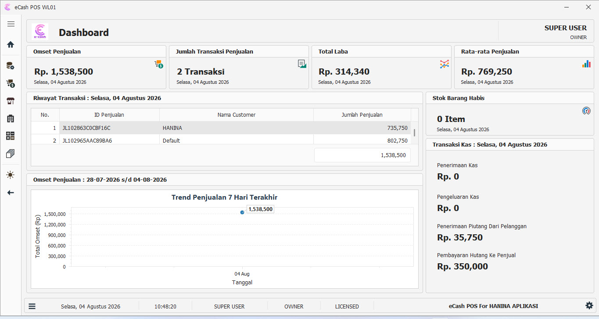

---

### Point of Sale

The sales module is designed to handle daily retail transactions, product selection, pricing, payment processing, and transaction management.

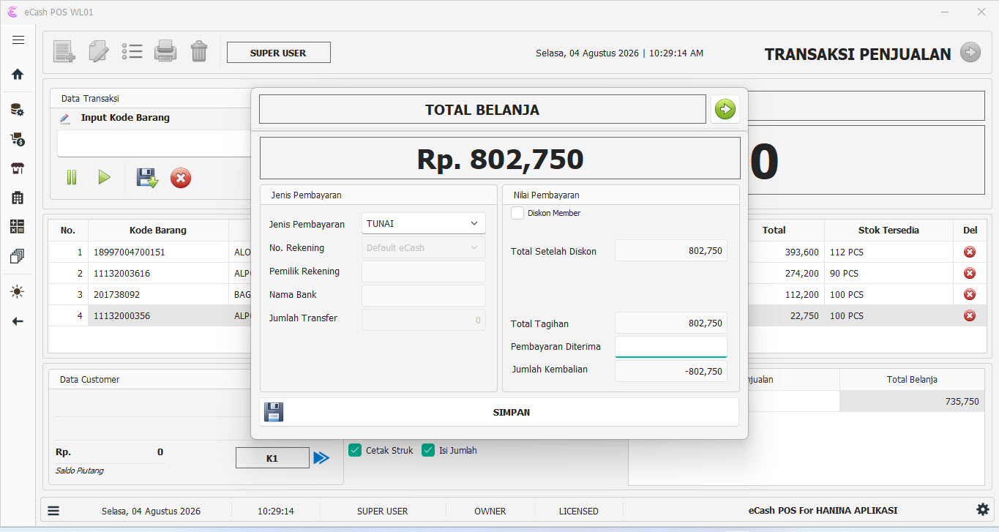

---

### Product Management

Manage products, categories, units, pricing, and other product-related information from a centralized interface.

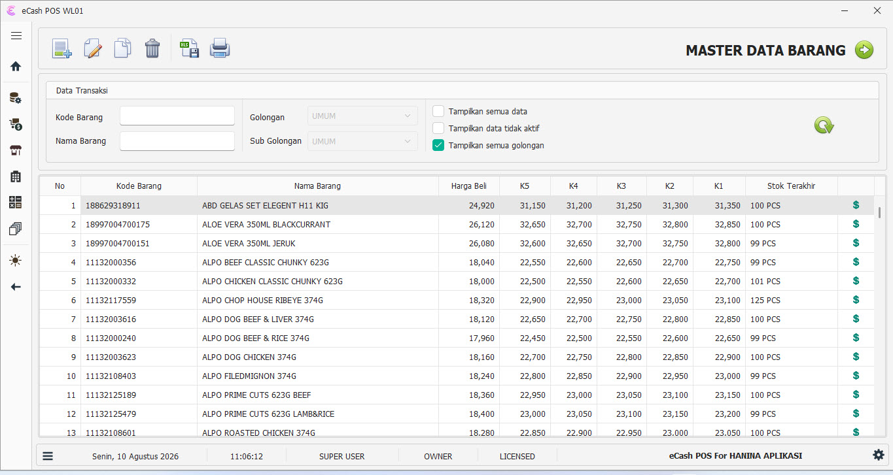

---

### Purchasing

The purchasing module manages supplier transactions and inventory acquisition.

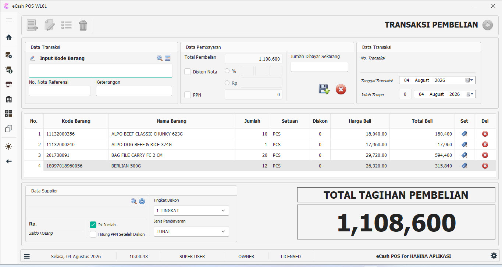

---

### Sales

Sales transaction management provides detailed information about completed transactions and sales activities.

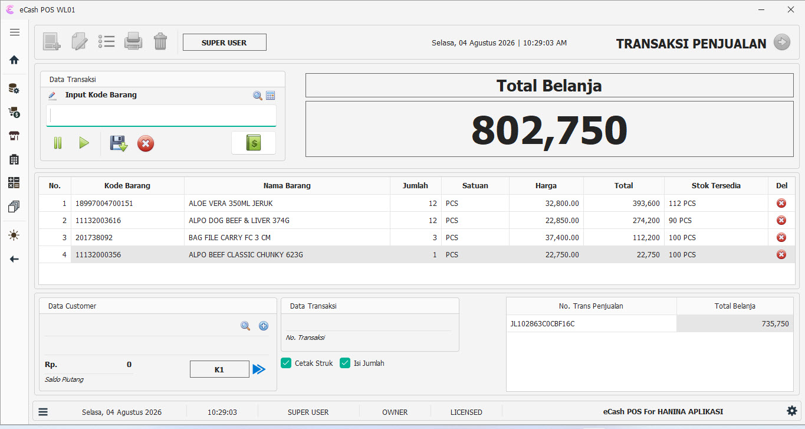

---

### Inventory Management

Inventory management helps businesses monitor stock levels and stock movements across their operations.

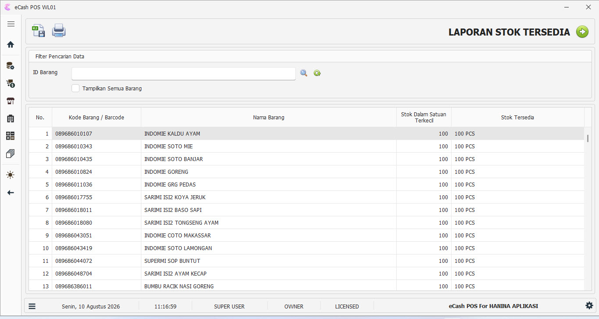

---

### Stock Opname

The stock opname module helps users compare physical inventory with system records and make necessary stock adjustments.

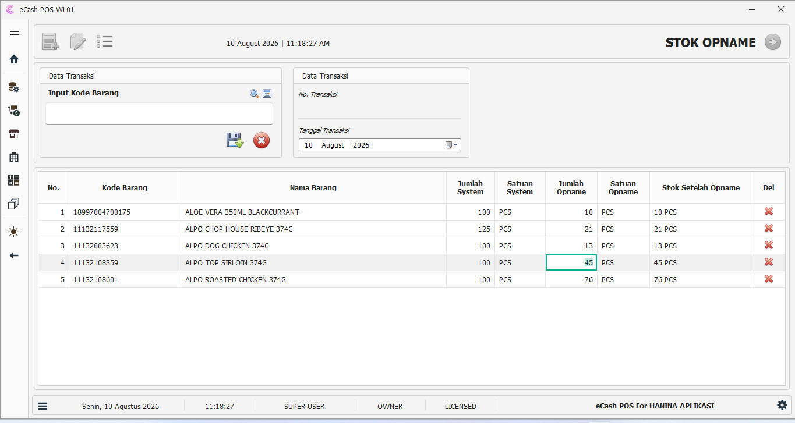

---

### Customer Management

Manage customer information and customer-related transactions.

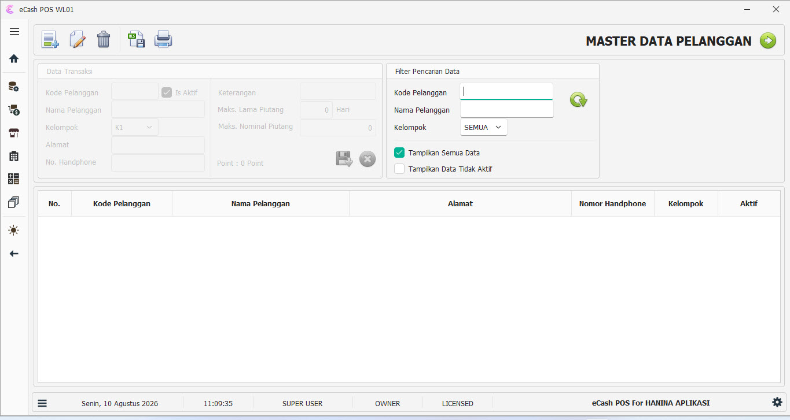

---

### Supplier Management

Manage suppliers and purchasing-related information.

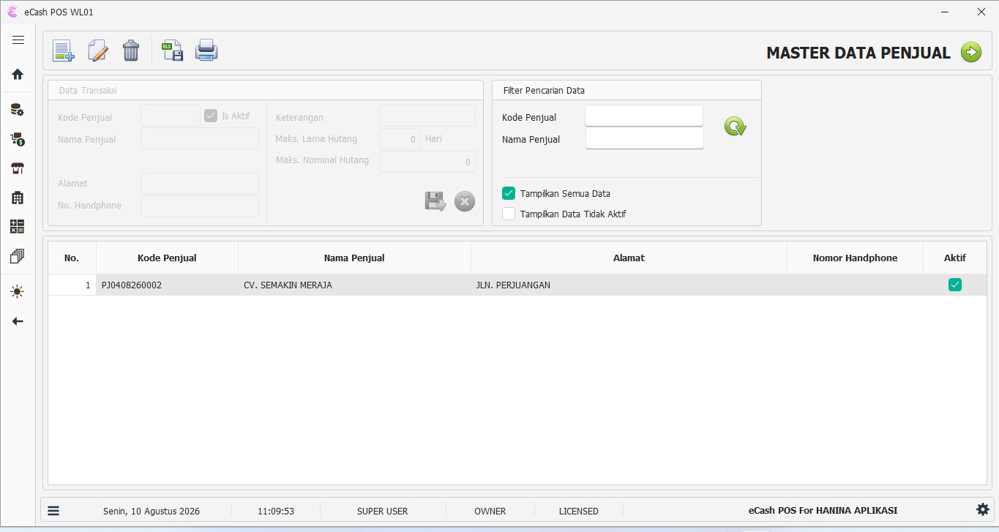

---

### Accounts Receivable

Track customer receivables and outstanding payments.

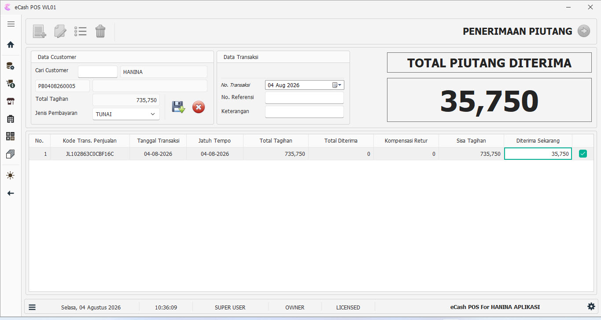

---

### Accounts Payable

Manage supplier payables and outstanding obligations.


---

### Business Reports

Generate reports to help business owners monitor transactions, inventory, sales performance, and other operational information.

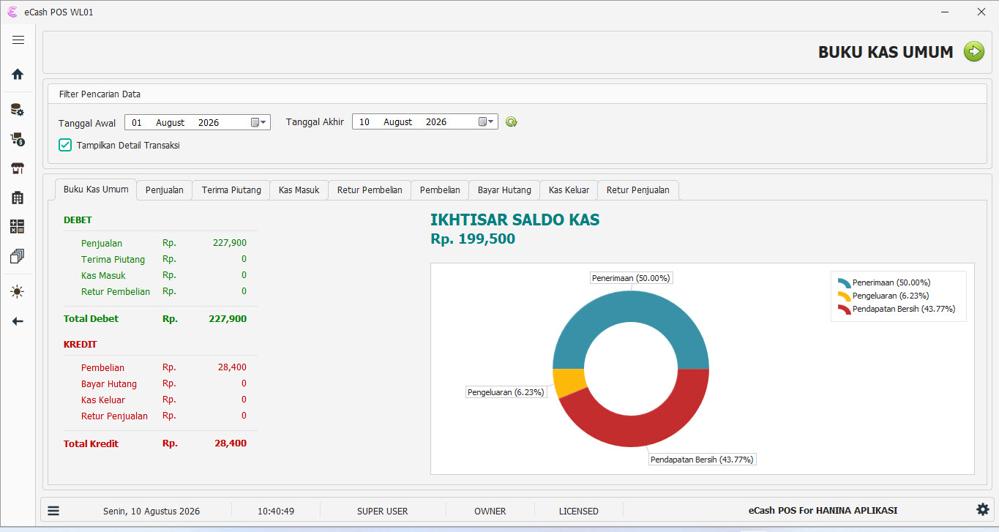

---

# 🚀 Key Features

## Point of Sale

* Sales transaction processing
* Product search
* Barcode support
* Multiple units
* Multiple pricing levels
* Payment processing
* Transaction history
* Thermal printer support

## Inventory

* Product management
* Categories and subcategories
* Multiple units
* Stock movement
* Stock opname
* Inventory monitoring

## Purchasing

* Supplier management
* Purchase transactions
* Purchase details
* Stock updates
* Supplier payable tracking

## Sales Management

* Customer management
* Sales transactions
* Sales details
* Customer receivables
* Sales reporting

## Financial Management

* Accounts receivable
* Accounts payable
* Sales analysis
* Profit reporting
* Cash flow related reporting

## Reporting

* Sales reports
* Purchase reports
* Inventory reports
* Stock reports
* Profit reports
* Customer reports
* Supplier reports

---

# 🏗️ Business Modules

```text
eCash POS
│
├── Dashboard
│
├── Master Data
│   ├── Products
│   ├── Categories
│   ├── Subcategories
│   ├── Customers
│   └── Suppliers
│
├── Sales
│   ├── Point of Sale
│   ├── Sales Transactions
│   └── Receivables
│
├── Purchasing
│   ├── Purchase Transactions
│   └── Payables
│
├── Inventory
│   ├── Stock
│   ├── Stock Movement
│   └── Stock Opname
│
└── Reports
    ├── Sales
    ├── Purchasing
    ├── Inventory
    └── Business Reports
```

---

# 🛠️ Technology Stack

### Desktop Application

* VB.NET
* .NET
* Windows Forms
* DevExpress

### Database

* SQL Server
* MySQL

### Hardware Integration

* Barcode Scanner
* Thermal Printer
* Cash Drawer

---

# 💡 Business Problems Solved

Many small and medium-sized businesses still rely on spreadsheets or disconnected systems to manage their daily operations.

eCash brings essential business processes into a single application:

```text
Products
   ↓
Purchasing
   ↓
Inventory
   ↓
Sales
   ↓
Receivables
   ↓
Reports
```

This integrated approach helps reduce manual data entry, improve inventory visibility, and make operational information easier to access.

---

# 🎯 Target Users

eCash can be adapted for various types of businesses, including:

* Retail stores
* Grocery stores
* Minimarkets
* Wholesale businesses
* Distributors
* Small warehouses
* Restaurants and cafes
* Other small and medium-sized businesses

---

# 👨‍💻 Development Experience

eCash is one of the business applications developed by **Hanina Aplikasi** as a practical solution for real-world retail and business operations.

The project demonstrates experience in:

* Desktop application development
* Business process analysis
* Database-driven application development
* POS development
* Inventory management
* Transaction processing
* Business reporting
* Hardware integration
* User interface development
* Application deployment and maintenance

---

# 🔒 Source Code

The source code of eCash is **private** because this is a commercial software product.

This repository is provided as a **portfolio and technical case study** to demonstrate the application's features, architecture, technology stack, and business capabilities.

---

# 🏢 Hanina Aplikasi

**Hanina Aplikasi** focuses on developing business software and custom applications for small and medium-sized businesses.

### Services

* Custom Business Software
* Desktop Application Development
* POS Development
* Inventory Management Systems
* VB.NET / C# Development
* DevExpress Application Development
* SQL Server / MySQL Development
* Legacy Application Maintenance
* Business Process Automation
* Custom Reporting

---

## 📫 Contact

GitHub: [github.com/phophobee](https://github.com/phophobee)

For custom software development or business application projects, please contact **Hanina Aplikasi**.

---

⭐ This repository is a portfolio showcase of the eCash POS project.
